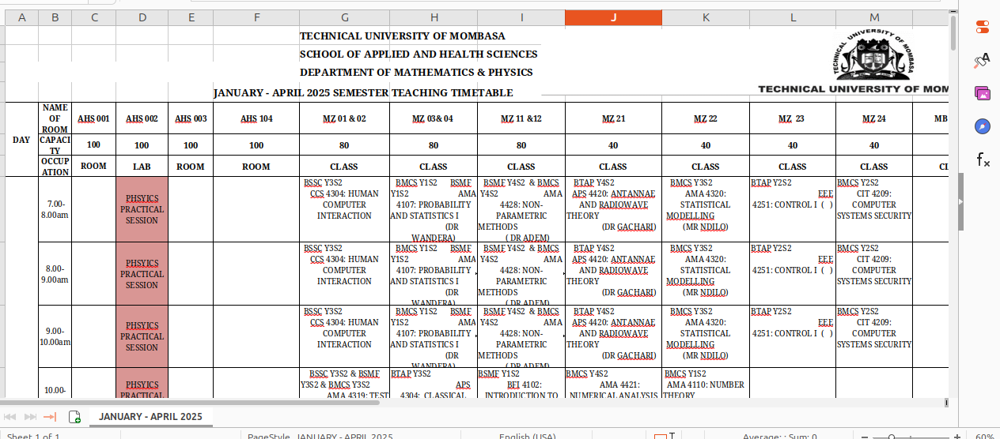
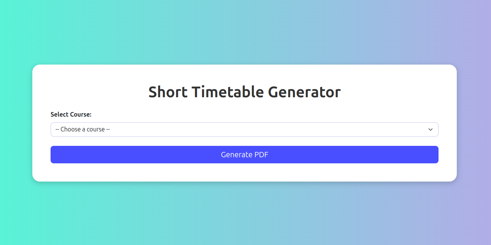
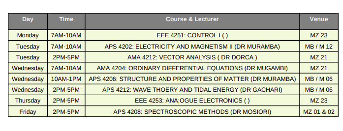

# 📅 Automatic Timetable PDF Generator
This project is a Python-based timetable processing tool that reads an Excel file (Technical University Timetable), filters relevant timetable data based on a specified course (e.g., BMCS Y2S2), and generates a well-structured PDF version of the timetable.
## 🚀 Features
- ✅ Extract Timetable Data: Automatically detect and extract course-specific data from raw Excel files.
- ✅ Smart Filtering: Finds and keeps only the necessary rows and columns, including course names, days, times, and room names.
- ✅ Robust Pattern Matching: Recognizes day names (even with typos like MOnd ay), time formats (e.g., 8.00, 9.30), and room names.
- ✅ PDF Generation: Converts the cleaned timetable into a neatly formatted PDF file.
- ✅ Safe Directory Handling: Ensures output folders (like uploads/) are created automatically without errors.

  ## 🏗️ Project Structure

```plaintext
.
├── app.py                 # Flask backend (if applicable)
├── templates              # Contain html file
├── uploads/               # Auto-created folder for storing generated PDFs
├── requirements.txt       # Required Python packages
```
##   📝 Requirements
- Python 3.x
- Flask (optional, for web interface)
- pandas
- reportlab
- openpyxl
  ## 📄 Example Output
- From a table like.

  
- In the home page of the website, the file gets uploaded.

- After clicking upload, the application will process the courses in the table and suggest them as a drop down menu in the second page.


- After clicking generate pdf, the application will simplify the timetable into a simplified version based on the course you choose.
- Below is an output of timetable when the course BTAP Y2S2 wa choosen.


